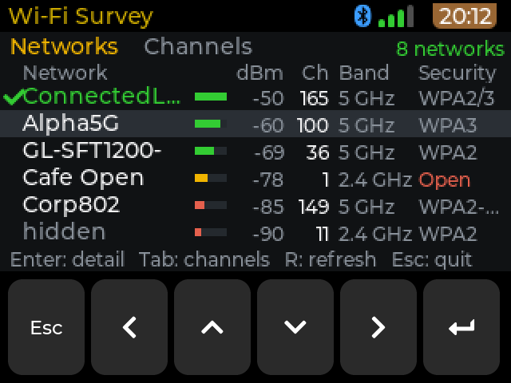
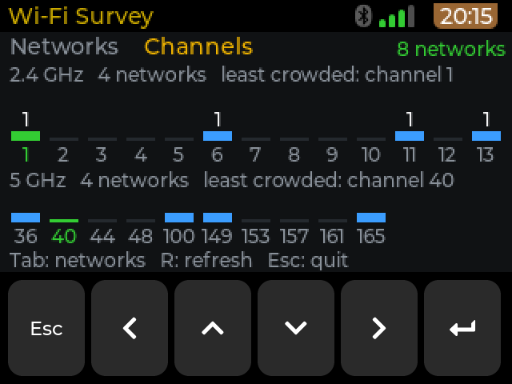

# cyberdeck-zero-apps

Apps for the [cyberdeck-zero-launcher](https://github.com/OSRdesign/cyberdeck-zero-launcher) (the CardputerZero
launcher on a Raspberry Pi Zero 2W), installable from the deck's **Settings > Apps** menu.

This repository is both the **app source** of that menu and a **template**: copy it and you can host your own
apps for the deck in a few minutes, with nothing but a public GitHub repository.

## Apps

| App | What it does |
| --- | --- |
| **LAN Scan** (`lanscan`, 0.1.1) | Lists the devices on your Wi-Fi network (IP, MAC, vendor, name) and scans the open ports of one of them. |
| **viz1090** (`viz1090`, 0.1.1) | The real [viz1090](https://github.com/nmatsuda/viz1090) ADS-B display, full screen, with its own RTL-SDR decoder, an intro screen (type the nearest airport code, or use a GPS) and a world map. Needs an RTL-SDR dongle and a launcher with full-screen app support. |
| **Wi-Fi Survey** (`wifi-survey`, 0.1.0) | Shows the Wi-Fi networks around the deck: a **Networks** list (name, signal, channel, band, security, the network you are connected to marked) and a **Channels** chart that points out the least crowded channel. Passive only: it reads the scan results of NetworkManager (`nmcli`), nothing is sent, captured or connected. Depends on `network-manager`. |

### Changes

* **LAN Scan 0.1.1**: the source now lives in this repository, in `apps/lanscan/src`, and is built with
  `apps/lanscan/build/build.sh` (same method as Wi-Fi Survey: the script copies the source into a scratch project of
  a launcher checkout, runs `scons` and puts the binary in `apps/lanscan/root/`). It was moved unchanged: on the deck
  the scan, the vendor names (from `oui.tsv`), the port scan and the keys behave as in 0.1.0. The deck offers it as
  an update in **Settings > Apps**.
* **viz1090 0.1.1**: touch works again when the Bluetooth keyboard is connected. 0.1.0 opened a fixed
  `/dev/input/event1`, which on the deck is sometimes the infrared node of the RTL-SDR dongle and not the screen.
  The display layer now looks through `/dev/input/event*` for the touch screen (a device that reports multitouch
  positions and is not a keyboard, the Goodix panel first) and tries again every second if it is absent or goes away.
  `VIZ_TOUCH=/dev/input/eventN` still forces a device. On the deck the right device was opened at every launch,
  the keyboard, Esc and the close button kept working, and touch recovered by itself after an interruption.

Known limits: the touch behaviour of both apps was checked with test touch events, not with a finger, until the
owner of the deck has tried it. After an upgrade through the Apps menu the tile moves to the end of the launcher
grid.

### Wi-Fi Survey

The app runs in the launcher's normal 640x340 window, under the top bar. A scan runs about every 5 seconds.

| Key | Action |
| --- | --- |
| Left / Right / Tab | Switch between Networks and Channels |
| Up / Down | Move in the list |
| Enter | Open the detail of the selected network (Left / Right then show the previous / next one) |
| R | Rescan now |
| Esc | Back from the detail, or quit |

The detail view follows the access point by its BSSID, so it stays on the same network when the list reorders
after a scan. If the network disappears, the title shows "- gone" and the last known values stay on screen until
it returns. The screenshots below were taken on the deck with test scan data.




## Install apps from this repository on a deck

On the deck: **Settings > Apps > Sources > + Add a GitHub source**, enter `OSRdesign/cyberdeck-zero-apps`, then
go to the **Apps** tab, pick an app and press Enter to install. Installing asks for the deck user's sudo password
(a `.deb` package is installed as root). Remove an app from the same menu.

(The Store app can use the same repository: add the registry URL
`https://raw.githubusercontent.com/OSRdesign/cyberdeck-zero-apps/main/registry.json` in its settings.)

---

# Host your own apps

An app source is just a **public GitHub repository** that contains:

```
registry.json                 the catalogue the deck reads (generated by tools/make_registry.py)
packages/<name>_<ver>_arm64.deb   one Debian package per app version
apps/<id>/app.json            what you write: name, description, version, ...
apps/<id>/icon.png            optional icon (about 73x64 px)
apps/<id>/screenshots/*.png   optional 320x170 screenshots
apps/<id>/root/...            the files of the app, laid out as they must be on the device
tools/                        build_deb.py and make_registry.py (pure Python 3, no other dependencies)
```

The deck downloads `registry.json`, lists the apps in it, and installs the `.deb` an entry points to after
checking its MD5. The format is the CardputerZero Store registry format (schema 2), so a source you create here
also works in the Store app.

## 1. Create your repository

1. On GitHub, click **Use this template / Fork** on this repository (or copy its `tools/` folder into a new
   public repository). The repository must be **public** and its default branch must be **`main`**.
2. Delete `apps/lanscan/` and `packages/*` (or keep them as an example), then clear `registry.json`.

## 2. Build your program for the deck

Your app is a normal **aarch64 Linux executable** that draws a **320x170** picture; the launcher shows it
scaled 2x. The easiest way to write one is with the LVGL based SDK of the launcher: copy [`apps/lanscan/src`](apps/lanscan/src) (a small complete example, with its
[`build/build.sh`](apps/lanscan/build/build.sh)) into a checkout of the launcher repository and build it with
`scons` (see the launcher's `projects/APPLaunch/pizero2w/README.md`). Keys arrive as normal keyboard events
(arrows, Enter, Esc; hold Esc 3 s to quit), touch is turned into keys by the launcher
(Settings > Touch picks the behaviour per app).

A program that does not use the SDK works too: the launcher starts any executable. Terminal programs can use
`Terminal=true` in the `.desktop` file (below) and run in the launcher's full-screen terminal.

## 3. Describe the app

`apps/<id>/app.json`:

```json
{
  "share_code": "myapp",
  "package": "myapp",
  "version": "0.1.0",
  "title": "My App",
  "summary": "One line shown in the list.",
  "description": "A longer description shown on the detail page.",
  "categories": ["Tools"],
  "author": {"github": "your-github-name", "display_name": "Your Name"},
  "license": "MIT",
  "source_repo": "https://github.com/your-github-name/myapp",
  "depends": "",
  "permissions": {"network": true}
}
```

* `share_code` – short unique id (lowercase letters and digits). It also gives the app a stable identity:
  keep it the same across versions.
* `package` – the Debian package name (lowercase letters, digits, `+ - .`).
* `version` – increase it for every release; the deck offers an upgrade when it grows.
* `depends` – optional Debian dependencies that `apt` must have (e.g. `curl`); leave empty if none.

## 4. Lay out the files

Put the files of the app under `apps/<id>/root/`, exactly where they must end up on the device:

```
apps/myapp/root/usr/share/APPLaunch/bin/M5CardputerZero-myapp        <- your executable
apps/myapp/root/usr/share/APPLaunch/applications/myapp.desktop       <- the launcher entry
apps/myapp/root/usr/share/APPLaunch/share/images/myapp.png           <- the tile icon
```

`myapp.desktop` (file name = `share_code` + `.desktop`):

```ini
[Desktop Entry]
Name=My App
Exec=/usr/share/APPLaunch/bin/M5CardputerZero-myapp
Terminal=false
Icon=share/images/myapp.png
Type=Application
```

`Exec` must be an absolute path to an executable (no shell tricks). `Icon` is relative to
`/usr/share/APPLaunch/`. Anything else your app needs (data files, fonts) goes in the same tree, under
`usr/share/APPLaunch/share/<your-app>/` to avoid clashing with other apps. Files under a `bin/` directory
become executable automatically.

## 5. Build the package and the registry

```
python3 tools/make_registry.py
```

This builds `packages/myapp_0.1.0_arm64.deb` from `apps/myapp/root/`, computes its MD5/SHA-256/size and writes
`registry.json` with raw.githubusercontent.com URLs (owner and repository are read from your git remote; pass
`--owner` / `--repo` if needed). It prints the registry address, for example
`https://raw.githubusercontent.com/you/your-apps/main/registry.json`.

Check a package without installing it, on Linux: `dpkg-deb -I packages/myapp_0.1.0_arm64.deb` and
`dpkg-deb -c ...`.

## 6. Publish

```
git add -A
git commit -m "myapp 0.1.0"
git push
```

That is all: no GitHub Pages, no release needed. Packages above 50 MB are better attached to a **GitHub
Release**: upload the `.deb` there and set `download.url` of that entry to the release asset URL (edit
`registry.json` after generating it; GitHub refuses files above 100 MB in a repository).

## 7. Add your source on the deck

**Settings > Apps > Sources > + Add a GitHub source**, then type `your-github-name/your-apps` (a full
`https://github.com/you/your-apps` address or a direct `registry.json` URL also work). The deck syncs the
registry and your apps appear in the **Apps** tab of **Settings > Apps**.

To publish an update, raise `version` in `app.json`, run `tools/make_registry.py`, commit and push; the deck
shows the new version after **Sync my sources** (GitHub's cache can delay it by a few minutes).

## Good to know

* **Trust.** Installing a package runs it as root (`dpkg`), and an app runs with your user's rights. Only add
  sources you trust and read what you install. The MD5 in the registry protects against a corrupted
  download, not against a malicious author.
* **`review.status`.** The Store installs only entries marked `approved`. `make_registry.py` sets it for you,
  because you are the reviewer of your own repository.
* **Updates need a new version number.** The deck compares versions; re-uploading a `.deb` with the same
  version is not seen as an update.
* **Architecture.** Packages are `arm64` (aarch64); a binary built for another CPU installs but does not run.
* **Several sources** can be enabled at once; an app with the same `share_code` in two sources is shown once
  (the source listed last wins).

## Licence

MIT. LAN Scan and Wi-Fi Survey use the IEEE OUI registry (vendor names) published at
<https://standards-oui.ieee.org/>. Both run on the LVGL based `cp0_lvgl` runtime of the M5CardputerZero launcher
(M5Stack, MIT).
