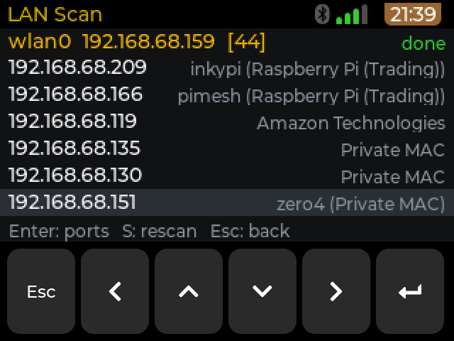
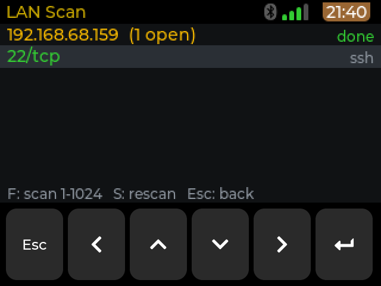

# LAN Scan

Version 0.1.2, package `lanscan`. Part of [cyberdeck-zero-apps](../../README.md).

LAN Scan lists the devices on the Wi-Fi network the deck is connected to (IP, MAC, vendor, name) and scans the
open ports of the one you select.

## Features

* Device list of the local network with IP address, MAC address, vendor and name. Names come from mDNS and
  NetBIOS first, then from reverse DNS for the rest. Vendors come from the IEEE OUI list shipped with the app
  (`oui.tsv`).
* A TCP connect scan of the common ports (with the usual service name), or of ports 1-1024, on the device you
  select. Open ports are listed with a progress figure while the scan runs.
* Needs no root and no extra tools. It only ever scans the subnet the deck is connected to (never more than a /24).
  Use it on networks you own or are allowed to test.

## Install

On the deck: **Settings > Apps > Sources > + Add a GitHub source**, enter `OSRdesign/cyberdeck-zero-apps`, go to the
**Apps** tab, pick **LAN Scan** and press Enter. Installing asks for the deck user's sudo password. See the
[repository README](../../README.md) for details. If an older version is installed, the deck offers 0.1.2 as an
update in the same menu.

## Use

The app starts a scan of the network at once. The top line shows the interface, the deck's IP and the number of
devices found; the status shows the progress ("done" at the end).

| Key | Action |
| --- | --- |
| Up / Down | Move in the list |
| Enter | Device list: scan the common ports of the selected device |
| F | Port list: scan ports 1-1024 |
| S | Rescan: the network in the device list, the same device in the port list |
| Esc | Port list: back to the device list. Device list: nothing, only a short hint "Hold Esc 3 s to exit". A short Esc never quits; hold Esc for 3 seconds to exit (handled by the launcher) |

Touch: tapping a device row opens its port scan (tried with a finger on the deck).

## Screenshots

The device list (the device names and addresses are those of the test network):



The port list of one device:



## Requirements

* A deck connected to a network (Wi-Fi or Ethernet). Without one the app shows "No network".
* Nothing else: no root, no extra package.

## Known limits

* After an upgrade through the Apps menu the tile moves to the end of the launcher grid.
* Only the local subnet (at most a /24) is scanned, and only TCP connect scans are made.

## Changes

* **0.1.1**: the source now lives in this repository, in `apps/lanscan/src`, and is built with
  `apps/lanscan/build/build.sh` (same method as Wi-Fi Survey: the script copies the source into a scratch project of
  a launcher checkout, runs `scons` and puts the binary in `apps/lanscan/root/`). It was moved unchanged: on the deck
  the scan, the vendor names (from `oui.tsv`), the port scan and the keys behave as in 0.1.0. The deck offers it as
  an update in **Settings > Apps**.

## Build from source

The source is in [`src`](src) (an LVGL application for the launcher's `cp0_lvgl` runtime). The build runs in WSL
(Ubuntu), because it cross-compiles to aarch64, and needs a checkout of the launcher repository with its
`.venv-pizero2w` (the script looks in `/mnt/c/CLAUDE/zero7/launcher`; set `LAUNCHER` to change it):

```
wsl -e sh /mnt/c/CLAUDE/zero7/cyberdeck-zero-apps/apps/lanscan/build/build.sh
```

[`build/build.sh`](build/build.sh) copies `src/` into the scratch project `projects/LanScanBuild` of the launcher
checkout (kept out of the launcher's git), runs `scons` under the shared build lock, and installs the binary as
`root/usr/share/APPLaunch/bin/M5CardputerZero-LanScan`. Then, at the root of this repository, run
`python3 tools/make_registry.py` to build the package and `registry.json`. Only `root/` goes into the `.deb`; this
page, `src/` and `build/` do not.

`src/tools/make_oui.py` rebuilds `oui.tsv` from the IEEE OUI registry (`python3 tools/make_oui.py`).

## Credits and licence

MIT. Vendor names come from the IEEE OUI registry published at <https://standards-oui.ieee.org/> (company names are shortened for the small screen; no formal licence is
given with the listing). The app runs on
the LVGL based `cp0_lvgl` runtime of the M5CardputerZero launcher (M5Stack, MIT).
