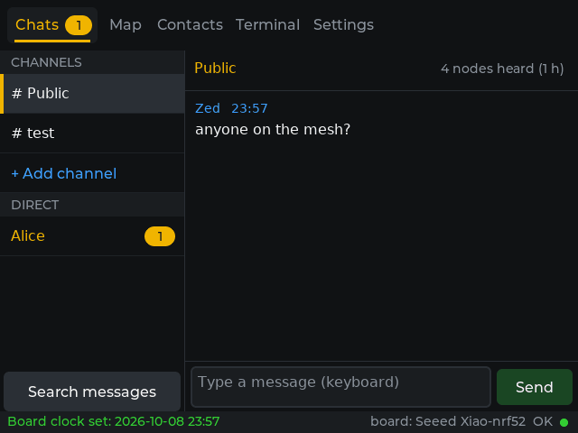
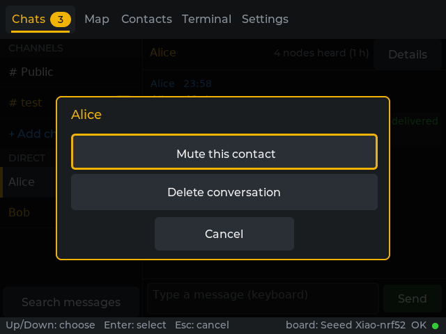
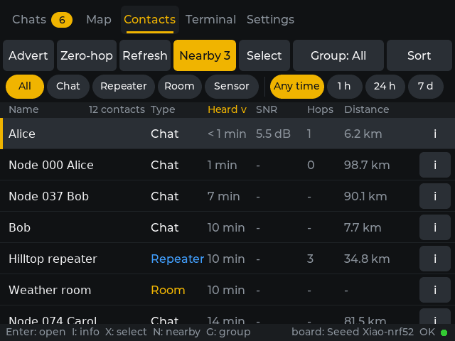
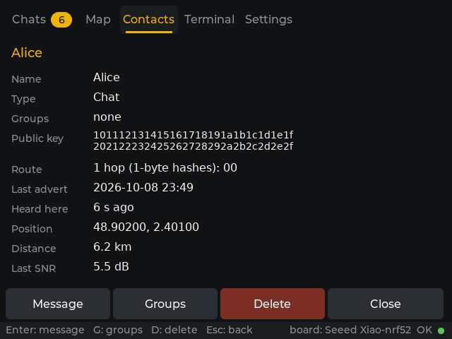
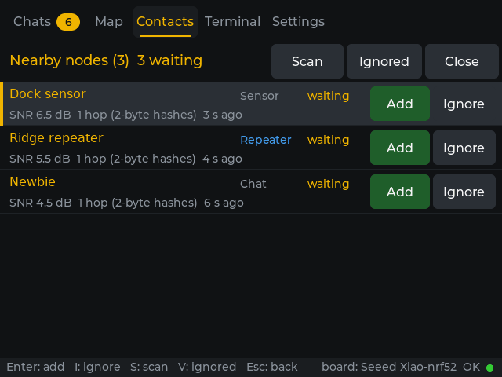
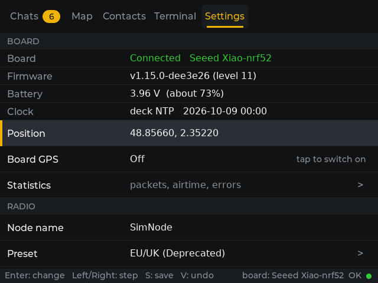
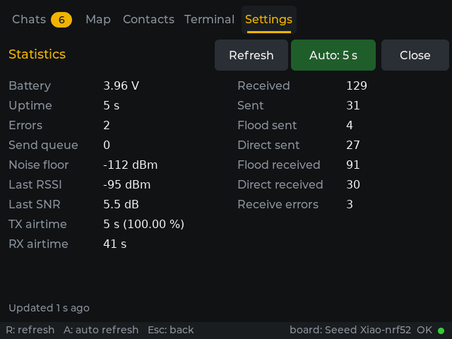
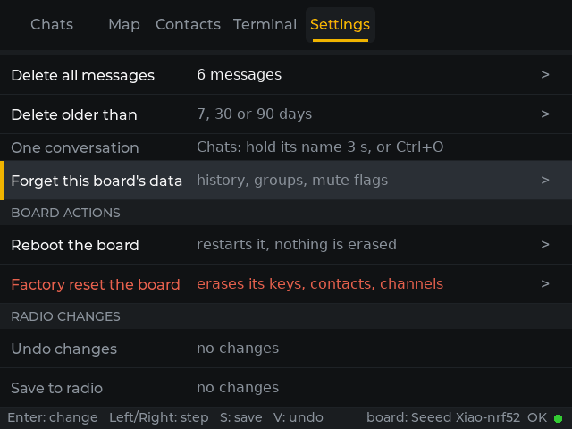

# Mesh Hop

Version 0.3.0 (in test; 0.2.2 is the published one), package `mesh-hop`. Part of [cyberdeck-zero-apps](../../README.md).

**Status: early release, published in the registry.** Install it from **Settings > Apps** like the other apps (see
[Install and requirements](#install-and-requirements)). Version 0.2.2 was tested on the deck by the owner with real boards (Seeed XIAO
nRF52840 and a spare XIAO S3 WIO, MeshCore firmware v1.15.0, a board swap included). Several MeshCore features are not there yet
(see [Known limits](#known-limits)). The screenshots below come from the simulator, not from the panel.

A full-screen (640x480) client for [MeshCore](https://github.com/meshcore-dev/MeshCore) LoRa mesh networks. The radio is a
separate **companion radio board** plugged into the deck's USB port (MeshCore *companion radio, USB* firmware); the deck is
its screen and keyboard. Mesh Hop replaces the 320x170 UI of [MeshZero](../meshzero/README.md) with a UI made for messaging and keeps everything below
it: the serial transport, the protocol, the client, the model and the history store (`src/main/core/`, a copy of the
MeshZero core with unit tests). `apps/meshzero` stays as it is until Mesh Hop is accepted.

## Screenshots

Made with the simulator's headless mode (`mesh-hop --headless`, a simulated board with invented names and test data), **not on the
deck's panel**. The real screen shows the same 640x480 picture.

| | |
| --- | --- |
|  Chats: channels and direct conversations with unread pills, the conversation, entry and Send |  The options box of a conversation (Ctrl+O, or a 3 s hold on its name) |
|  Contacts: sortable table, filter chips, Select, Group, Nearby |  Details of a contact: key, route, last advert, position |
|  Nearby: the nodes heard, with Add and Ignore |  Settings: board status, name, radio |
|  Statistics of the board |  Settings > History and the board actions |

## What it does

* **Chats**: two panes. Left: the channels and the direct conversations, each with the **number of unread messages** (a gold
  pill; nothing for none, "muted" for a muted channel); the total of unread messages is on the **Chats tab title**. Right: the
  conversation with the time of each message and the status of yours, a message entry and a **Send** button. A channel
  message ends at **sent** when the board accepts it (a channel has no acknowledgement, so never "delivered"; if the board
  does not answer within 5 s it shows "sent (unconfirmed)"); a direct message goes sending, sent, delivered or no ack.
  **Heard back by N repeaters** (phase 3): the board reports every radio packet it hears (PUSH_LOG_RX_DATA, no command needed). When
  your own channel message comes back from the mesh, "sent" becomes "heard back by N repeaters"; N grows while it keeps coming back
  over new routes for 60 s, then it is final and saved with the message. Read it as a hint, not a count of repeaters: the app cannot
  decrypt, so it matches the channel hash and the size of the packet; **N is the number of distinct routes** (a copy heard straight
  from the sender is not counted; one repeater reached over two routes counts twice, two repeaters with the same short hash once), and
  another person's message of the same size on the same channel in the same minute can be taken for yours. It needs the channel key
  read from the board in this session (done at connect; a firmware without channel commands gets no count). Direct messages keep their
  acks and are not counted.
  **Mute** (Ctrl+M, or the options box: Ctrl+O or a 3 s hold on the name) silences a channel or a contact: no pill, not counted in the tab total, "muted" in the list.
  **Options of a conversation** (Ctrl+O, or hold a finger 3 s on its name in the list or in the header; a bar shows the hold
  filling): a direct chat offers *Mute / Unmute this contact* and *Delete conversation*; a channel offers *Mute / Unmute* and
  *Delete messages*. Deleting asks Yes / No first with the number of messages, removes them from memory and from the history
  file, and a deleted direct conversation leaves the left pane (the contact stays in Contacts and on the board; a new message
  starts the conversation again; a channel stays, only its history is cleared).
  **+ Add channel** opens a menu: a hashtag channel (`#name`), a private channel with a key typed as 32 hex characters, or a
  private channel with a random key (shown as text to share). A direct chat has a **Details** button (the contact's details).
* **Search messages** (new in 0.2.0; the button under the left list, or Ctrl+F): type the words (they are matched in the text and
  in the sender's name, upper and lower case alike) and narrow the result by **chat** (Ctrl+K), **dates** (Ctrl+D: any date, last 24 h,
  7, 30 or 90 days, or a typed day or range like `2026-09-01 2026-09-30`) and **direction** (Ctrl+R: all, received, sent). The
  results are listed newest first with the time, the chat, the sender and the text around the match; a tap (or Enter) opens the
  conversation at that message, framed in gold. It searches what the deck keeps (200 messages per conversation, 1500 in all).
* **Contacts**: table of name, type, last heard, SNR, hops and distance (when both positions are known). Tap a column title
  or press `S` to sort (`R` reverses); a "Loading..." box shows while a long list is re-sorted or filtered, the chosen order
  is kept, and the row you tap is the row that opens. **Filter chips** by node type and by time since last heard; keys `T` and
  `H` cycle them. The list is virtual: only the rows in view are widgets, so Up/Down on 161 contacts is as quick as a touch
  scroll. Enter opens the chat of a chat node, or the detail of a repeater, room or sensor. New in 0.2.0:
  * **Details** (the **i** box at the right of a row, key `I`): name, type, groups, the whole public key, the route (flood, direct,
    or the hops with their hash size and the hashes), last advert, when we heard it, position, distance, SNR; large buttons
    Message, Groups, Delete, Close.
  * **Select** (key `X`): a check box on every row; a tap or Space / Enter marks, **Select...** offers all shown, none, not heard
    for 7 or 30 days or more, never heard, invert; **Delete n** asks Yes / No with the count (and says what hidden-by-filter marks
    stay), then deletes **one by one on the board** with a progress box and a Stop button. **Group...** adds the marked contacts to
    a group, takes them out, or makes a new group with them.
  * **Groups** (kept on the deck, per board, in `groups.jsonl`, the previous version in `groups.bak`; the board knows nothing of them): the
    **Group** button (key `G`) filters the table by one group, and makes, renames or deletes groups.
  * **Nearby** (key `N`; the button turns gold with the number of waiting nodes): the nodes heard, newest first, pending ones first,
    each with its type, SNR, hops (and hash size), age, and **Add** / **Ignore** (touch or `Enter` / `I`). Sources: the advert pushes
    of the board, the adverts in its radio log (name, type, position, SNR, hops), the pending contacts of the manual add mode,
    and **Scan** (key `S`): a zero-hop discover that asks the nodes in direct radio range to answer (8 s). Ignored nodes are hidden
    (the **Ignored** button shows them and restores them).
* **Settings**: board status (connection, model, firmware level, battery, clock, **position**: only the position, or "not set") and, when the
  firmware lists the `gps` custom variable, a **Board GPS** switch; **Statistics**; node name; **Preset** (the radio presets of
  `api.meshcore.nz`: 26 are built in, dated 2026-10-07, see `src/main/core/radio_presets.inc`; when the deck is online the app
  refreshes the list in the background at launch, once more 60 s later if that failed, keeps the last good copy in
  `~/.local/share/mesh-hop/presets.jsonl` and says in the preset box which list it shows), frequency, **bandwidth, spreading factor,
  coding rate and TX power in a choice box** (the value in the middle, a large arrow on each side: touch the arrows, or Left /
  Right, Enter accepts, Esc cancels).
  * **Position box** (Enter or a tap on the Position row): the position the board holds, the **Board GPS** switch (only when the
    firmware lists the `gps` custom variable; a board without GPS shows none), and the **latitude** and **longitude** typed on the
    Bluetooth keyboard in decimal degrees ('.' or ',' before the decimals; Tab: next field, Enter: OK, Esc: cancel). A value outside
    -90..90 / -180..180, or not a number, is refused in the box and nothing is sent. OK sends SET_ADVERT_LATLON (`0E`, latitude and
    longitude in signed microdegrees, altitude 0) and reads the position back (SELF_INFO); **Clear** sets 0, 0, which the firmware and
    the app read as "no position". Setting a position sends no advert: the board puts it into its own adverts only when its location
    policy shares it (the box says which). With the board GPS on, the GPS fix replaces a typed position.
  New in 0.2.0:
  * **Path hash size**: 1, 2 or 3 bytes per repeater hash in the paths of the packets the board sends (MeshCore "path hash
    mode" 0, 1, 2). A larger hash means fewer collisions between repeaters but leaves less room per message. Read from the board
    (DEVICE_INFO, firmware level 10 and up), set with SET_PATH_HASH_MODE and read back; an older firmware shows the
    "Firmware too old for this feature" notice instead of the row. Repeaters on firmware 1.12 or older only know 1-byte hashes.
  * **Repeat** on or off (the companion's client repeat, firmware level 9 and up): only on the frequencies the board lists
    (GET_ALLOWED_REPEAT_FREQ), otherwise the row says why not; switching it on asks Yes / No.
  * **Scheduled advert**: off (default), every 1, 3, 6 or 12 h, flood or zero-hop. The board has no advert timer of its own: the
    app sends the advert while it runs and the board is connected.
  * **Contacts**: **Add nodes by itself** switches the manual add mode (off: new nodes wait in Nearby until you add them) and
    **Still added by itself** edits the auto-add filter (which types the board still adds in manual mode, and replace-oldest).
  * **Statistics** (firmware with GET_STATS): battery, uptime, errors, queue, noise floor, RSSI, SNR, TX / RX airtime and the
    packet counters; Refresh, and an automatic refresh every 5 s while the screen is open.
  * **Packet log** (phase 3, D8; under Statistics, a panel over Settings like the statistics): the radio packets the board hears, one row
    each: time (hh:mm:ss), route (FLOOD / DIRECT, `T-` with transport codes), payload type, hops, SNR, RSSI, payload size and, for a
    group text, the channel hash with the channel name when one of your channels has that hash (`a|b ?` when two share it). The
    selected row shows its path and its raw bytes in hex below. **Capture is off at every start**: Start / `S` / Space starts and
    stops it, Clear / `C` empties it, Up/Down/PgUp/PgDn/Home/End select (End follows the newest again), Esc or Close goes back. It
    keeps the last 500 packets in memory only; nothing is written to disk (no export yet).
  * **Reboot the board** (Yes / No) and **Factory reset the board** (two Yes / No boxes; the Yes of the second waits 3 s). A factory
    reset erases the board's keys (its identity), contacts and channels. The firmware formats its file system first (up to a minute on
    an ESP32 board), answers OK and restarts with a new identity; the app waits up to 60 s, then judges by the identity the board reports
    when it is back: a new public key shows "Board reset" (an empty board: its own empty chat list, the old identity keeps its data on the
    deck), the same key shows "not reset". The frame is the command byte `0x33` and the word `reset` (the firmware checks it). There
    is no power-off command in the companion protocol, so none is offered.
  * the rest as before: **direct message retries**, clock sync, the channels (the fixed Public channel is not listed): Mute, Key
    (shows the key as text) and Remove (asks Yes / No); a **History** section (*Delete all messages*, *Delete messages older than*
    7, 30 or 90 days); **Undo changes** and **Save to radio** are the last rows and each asks Yes / No.
  The board clock follows the deck policy of MeshZero (deck NTP, board GPS, or a typed start time).
* **Firmware check**: a feature the board's firmware lacks (custom variables, channel commands, path hash mode, repeat, statistics,
  auto-add filter, discover, factory reset) is switched off with the notice "Firmware too old for this feature"; a board without
  GPS shows no GPS row.
* **Map** and **Terminal**: placeholders for later versions (the packet log lives in Settings, next to the statistics).
* Footer: hints for the current screen on the left, the board (model and state) on the right. The top bar is the launcher's
  shared bar (clock, Wi-Fi, Bluetooth), the five tabs sit in its left part.
* **Per board (0.2.2).** The app knows the board by its public key (SELF_INFO). The history, read marks, the contact and channel caches,
  muted conversations, groups, ignored nodes and the advert schedule of each board are kept in
  `~/.local/share/mesh-hop/boards/<first 12 hex digits of the key>/` (JSON lines and text, bounded per board: 200 messages per conversation,
  1500 in all). Plugging another board shows that board's own conversations and contacts; plugging the first one back restores them.
  Before a board has answered, Chats is empty ("No board yet"). The retry settings, the presets cache, the port, the log stay global in
  `~/.local/share/mesh-hop`. The files of 0.2.1 and before (one set for "the" board) move into the folder of the first board that connects
  with this version; the originals stay as `*.pre-boards.bak`. The folders of boards that are not connected are kept; Settings > History
  has **Forget this board's data** and **Other boards' data** (forget the saved data of every board that is not connected, with the size).
  The old
  `~/.local/share/meshzero` is not touched or imported. `mesh-hop.log` in the same folder is the debug log (size bounded, no message
  text): it records each channel send and what the board answered, bulk deletes, reboot and factory reset requests, the preset
  refresh (`MESHHOP_DEBUG=1` logs every frame).

## Input rules

* Text is typed with the **Bluetooth keyboard only**. There is no on-screen keyboard. With no keyboard awake an editor says
  "Keyboard needed: wake the Bluetooth keyboard" and the entry box shows the same hint.
* Short **Esc is always Back** and never quits (it shows "Hold Esc 3 s to exit" on a top-level screen); **holding Esc for
  3 s** ends the app: the launcher does that. Esc closes the newest layer first: box, editor, search, statistics, packet log,
  details, Nearby, select mode.
* Everything is reachable by touch: tap rows, tabs, chips, arrows and buttons, drag to scroll lists and conversations.
  There is no swipe gesture. Buttons are at least 44 px high.

| Key | Action |
| --- | --- |
| Tab / Shift+Tab | next / previous tab, in a loop (there are no other tab keys) |
| Up / Down | Chats: select a conversation (list) or scroll (entry); Contacts, Settings, Nearby, results: move |
| Enter, or typing | Chats list: write; entry: send; Contacts: open (select mode: mark); Settings: change / do |
| Left / Right | Settings: step the value of the row; entry: move the cursor; choice box: previous / next value |
| Esc | Back (box to nothing, entry to list, close detail, Nearby, search, statistics or select mode) |
| Ctrl+M | Chats: mute / unmute the conversation (plain letters start a message); Settings, channel row: `M` |
| Ctrl+O | Chats: options of the conversation (mute, delete); the touch way is a 3 s hold on its name |
| Ctrl+F | Chats: search the messages (then Ctrl+K chat, Ctrl+D dates, Ctrl+R direction, Enter opens the result) |
| `S` `R` `T` `H` `A` `D` `U` | Contacts: sort, reverse, type filter, heard filter, advert, zero-hop advert, refresh |
| `X` `G` `N` `I` | Contacts: select mode, group filter, Nearby, details of the selected contact |
| Space / Enter, `A` `N` `I` `M` `D` `G` | Contacts, select mode: mark, all, none, invert, select menu, delete, group |
| Enter, `I`, `S`, `V` | Nearby: add, ignore (or restore), scan, show / hide the ignored |
| `G` `D` | Contact details: groups, delete |
| `R` `A` | Statistics: refresh, switch the automatic refresh |
| `S` or Space, `C`, Up/Down | Packet log: start / stop the capture, clear it, select a row |
| `S` `V` | Settings: save, undo (each asks Yes / No) |
| `K`, Del | Settings, channel row: show the key, remove the channel |
| `Y` `N` | Yes / No boxes |

The keyboard layout is US by default, AZERTY when `MESHHOP_KEYMAP=fr` or `XKBLAYOUT="fr"` is in `/etc/default/keyboard`.

## Install and requirements

**Requirements**

* A **MeshCore companion radio board** with the *companion radio, USB* firmware, plugged into the deck's USB port. Some
  features need a newer firmware (path hash size needs firmware level 10 and up, repeat level 9 and up; statistics, discover and
  factory reset need their commands); without them the row says "Firmware too old for this feature".
* A Bluetooth keyboard for all text (no on-screen keyboard). US layout (QWERTY) by default, AZERTY when `MESHHOP_KEYMAP=fr` or
  `XKBLAYOUT="fr"` is in `/etc/default/keyboard`.
* A launcher with **full-screen app support** (`X-Fullscreen=true` in the `.desktop` file).
* The user must be in the `dialout` group (the Raspberry Pi OS default user is).
* `curl` (the package depends on it; the radio preset list is downloaded by `/usr/bin/curl`; without it the app keeps the saved
  or built-in list) and `libfreetype6`.

**Install from the deck:** Settings > Apps > Sources > + Add a GitHub source `OSRdesign/cyberdeck-zero-apps` (if not added yet),
then Apps > Mesh Hop > Enter (it asks for the sudo password).

**Or install a local `.deb`** (for a build you made yourself). On a PC with this repository:

```
python tools/make_registry.py --only mesh-hop --out <a folder outside packages/>
```

Copy the `mesh-hop_0.2.2_arm64.deb` it writes to the deck and, on the deck:

```
sudo apt install ./mesh-hop_0.2.2_arm64.deb
```

(`apt` pulls `curl` and `libfreetype6` if missing.) The tile "Mesh Hop" appears in the launcher. Remove it with
`sudo apt remove mesh-hop`.

The board is found by itself (`/dev/ttyACM*`, `/dev/ttyUSB*`, by USB id); to force a port put its path in
`~/.local/share/mesh-hop/port` or start the app with `MESHHOP_PORT=/dev/...`. Fonts: the app reads the fonts the launcher
installs in `/usr/share/APPLaunch/share/font` (Montserrat, Font Awesome, DejaVu Sans) and falls back to its built-in
Montserrat without accents.

## Reboot and factory reset: read this

Settings > **Reboot the board** restarts it and erases nothing. Settings > **Factory reset the board** **erases the board's keys
(its identity), contacts and channels**; it asks two Yes / No questions and the Yes of the second waits 3 s. The board then
has a new identity: to the mesh it is a new node. Do not use it on the board you rely on unless you mean it.
Settings > History > **Forget this board's data**, **Other boards' data** and the *Delete* rows remove the deck's saved copy
of messages, groups and flags; each asks first.

## Files the app keeps

All in `~/.local/share/mesh-hop`. The log holds no message text.

| Path | What |
| --- | --- |
| `boards/<first 12 hex digits of the board key>/` | per board: `messages.jsonl` (history), `read.txt` (read marks), `contacts.jsonl` and `channels.jsonl` (caches), `groups.jsonl` (and `groups.bak`), `prefs.txt` (mute flags, ignored nodes, advert schedule) |
| `prefs.txt` | global: the direct message retry settings |
| `presets.jsonl` | the last good copy of the radio preset list |
| `port` | optional: the serial port to use |
| `mesh-hop.log` | debug log, size bounded |
| `*.pre-boards.bak` | the originals of the files of 0.2.1 and before, kept after they moved into the first board's folder |

## Known limits

* The **Map** and **Terminal** tabs are placeholders (no map tiles, no command line yet).
* **USB only**: no Bluetooth LE connection to the board yet (planned; the deck's Bluetooth is also used by the keyboard).
* A **channel message has no delivery acknowledgement** in MeshCore: it ends at "sent" (or "sent (unconfirmed)" if the board does
  not answer within 5 s), never "delivered". Direct messages do get "delivered" or "no ack".
* "Heard back by N repeaters" is an approximation (distinct routes, matched by channel hash and size; see Chats above). A count that
  is still moving when the app quits is lost; the final one is saved (an extra `"hb"` key in `messages.jsonl` that older versions ignore).
* The packet log is not saved or exported, and holds 500 packets at most.
* The scheduled advert runs only while the app runs and the board is connected (the board has no advert timer of its own).
* The deck keeps 200 messages per conversation and 1500 per board.
* The screenshots on this page come from the simulator, not from the panel.

## Credits and licences

Mesh Hop is MIT (see the `copyright` file of the package).

* **MeshCore** firmware and protocol: Scott Powell / rippleradios.com, MIT, <https://github.com/meshcore-dev/MeshCore>.
* **meshcore_py** (Florent de Lamotte, MIT, <https://github.com/meshcore-dev/meshcore_py>) was the reference of the wire
  format; the protocol code was written from the protocol documentation and from it. The radio presets come from the public list
  of `api.meshcore.nz`.
* **MeshCore Open** (MIT), **meshcore-gui** (MIT), **wadamesh** (GPL-3.0) and **Meshy** (GPL-3.0-or-later) were looked at as
  feature references only. **No code was copied from the GPL projects.**
* **LVGL** (MIT), **FreeType** (FreeType License or GPL-2, the system `libfreetype6`) and the status bar renderer of the
  M5CardputerZero launcher (`cp0_statusbar`, M5Stack, MIT). The launcher's fonts are read at run time (Montserrat, Font Awesome
  Free, DejaVu Sans: SIL OFL 1.1, CC BY 4.0 for the icons, Bitstream Vera / DejaVu licence); they are not in the package.

## Build and test

```
wsl -e sh /mnt/c/CLAUDE/zero7/cyberdeck-zero-apps/apps/mesh-hop/build/build.sh          # aarch64, into root/usr/share/APPLaunch/bin
wsl -e sh /mnt/c/CLAUDE/zero7/cyberdeck-zero-apps/apps/mesh-hop/build/build.sh host     # x86-64 PC build, headless mode (~/mesh-hop-host/mesh-hop)
wsl -e sh /mnt/c/CLAUDE/zero7/cyberdeck-zero-apps/apps/mesh-hop/src/tests/run_tests.sh  # unit tests (core, simulator, UI logic)
wsl -e sh /mnt/c/CLAUDE/zero7/cyberdeck-zero-apps/apps/mesh-hop/src/tests/ui_smoke.sh   # scripted run + screenshots against the simulator
```

Both builds use the launcher's SDK (LVGL, toolchain) through a scratch project under `projects/` of the launcher tree that is
kept out of git; nothing of this app is added to the launcher repository. `tools/meshcore_sim.py` simulates a board
(options: `--contacts N`, `--chan-reply ok|msgsent|odd|none`, `--old-firmware`, `--no-gps-var`; 0.2.0: `--fw-level N`, `--manual-add`,
`--new-nodes N`, `--max-contacts N`, `--repeat-ranges`, `--slow-remove SEC`, `--no-autoadd`, `--old-autoadd`, `--old-other-params`,
`--no-discover`, `--discover-reply`, `--no-stats`, `--old-stats`, `--no-factory-reset`, `--strict-reset-word`; 0.2.2: `--identity A|B` (a second
board with its own key, contacts and channels), `--reset-format-delay SEC`, `--reset-no-ok`; stdin commands `newnode`, `reboot`, `swap` (exchange the
board on the cable)). The scripts in `src/tests/` (`smoke.script`, `bigcontacts.script`, `chan-silent.script`, `firmware.script`, `offline.script`)
drive the headless mode (`mesh-hop --headless --script f --shot-dir d`: renders into memory, takes keys and taps from a script,
writes PNG screenshots, `bench <key> <n>` times key presses, `hold <x> <y> <ms> [shot]` keeps a finger down); it also runs on the deck, over ssh,
without touching the panel. `history_run.sh` seeds a history of every age and runs `history.script`; `presets_run.sh` (a local web
server stands in for `api.meshcore.nz`; `MESHHOP_ONLINE=0|1` forces the online test, `MESHHOP_PRESETS_URL` and `MESHHOP_CURL` replace the address and
the program) now also runs the retry case. 0.2.0 adds `p2_run.sh` (seeded history, the words `@D60@` in a script become the date 60 days
ago) with `p2-contacts.script`, `p2-nearby.script`, `p2-search.script`, `p2-settings.script` and `p2-oldfw.script`; the first line of each
says which simulator options to give. 0.2.2 adds `b-swap.script` (two boards, run with `SIMCTL=1`: the script command `sim <line>` types into the
simulator), `b-noboard.script` (`NOSIM=1`) and `b-reset.script` (`--reset-format-delay 4`). The Position box has `position.script` (a GPS board)
and `position-nogps.script` (`--no-gps-var --share-location`); the simulator keeps the position set by SET_ADVERT_LATLON (`--no-position` starts at 0, 0).
Phase 3: `--heard-back N` makes the simulator send our own channel messages back in its radio log over N routes 1 to 3 s after the send
(`--heard-back-direct` adds a copy with an empty path), and its radio log every 3 s alternates random bytes with well formed packets of other
traffic. `heard-back.script` (`--heard-back 2 --heard-back-direct`) and `packet-log.script` (`--heard-back 2 --new-nodes 2`) cover both features.

## Layout of the sources

| Path | What |
| --- | --- |
| `src/main/core/` | transport, protocol, client, model, store, clock policy, presets (`radio_presets.inc` is the dated data file), preset feed (strict parser, saved copy, background curl, download schedule), channel keys, firmware features, contact groups, message archive search, log, the radio log parser and echo tracker (`logdata.*`), the packet log ring (`packet_log.*`) (no LVGL; unit tested) |
| `src/main/ui/ui_logic.*`, `ui_phase2.cpp` | keys, editor filters, formatting, chat and contact rows, filters and sort state, selection, groups, details, Nearby rows, search rows, statistics view, popup logic, Settings layout, Back rule (no LVGL; unit tested) |
| `src/main/ui/platform.*` | framebuffer, touch and keyboard (evdev), headless mode |
| `src/main/ui/app.*` | the screens, the virtual row list, the popups |
| `src/main/ui/cp0_statusbar.[ch]` | the launcher's shared top bar, copied from `cyberdeck-zero-launcher/ext_components/cp0_lvgl` (keep in sync) |
| `src/main/src/main.cpp` | start-up, signals, the script runner of the headless mode |
