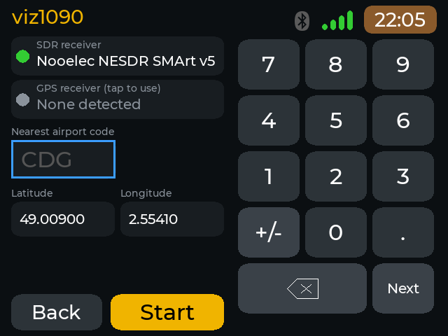
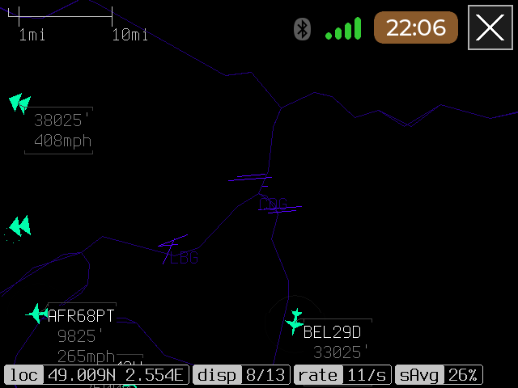

# viz1090

Version 0.1.1, package `viz1090`. Part of [cyberdeck-zero-apps](../../README.md).

The real [viz1090](https://github.com/nmatsuda/viz1090) ADS-B display (by Nathan Matsuda) on the deck, full screen,
with its own RTL-SDR decoder, an intro screen (type the nearest airport code, or use a GPS) and a world map.

## Features

* Live aircraft from an RTL-SDR dongle on a world map, in viz1090's own display.
* Its own decoder: readsb built with RTL-SDR support. It runs only while viz1090 is on screen.
* An intro screen that shows whether the SDR dongle and a USB GPS receiver are found, takes your position (the
  nearest airport code typed on the keyboard, the GPS position by tapping its panel, or latitude and longitude on
  a touch keypad), saves it and starts the display.
* The launcher's top bar (clock, Wi-Fi, Bluetooth) and a close button (X, top right) on the map.
* Your position and options are kept in `~/.config/cardputerzero/viz1090.conf`
  (`LAT`, `LON`, `UISCALE`, `METRIC`, `RADIUS`).

## Install

On the deck: **Settings > Apps > Sources > + Add a GitHub source**, enter `OSRdesign/cyberdeck-zero-apps`, go to the
**Apps** tab, pick **viz1090** and press Enter. Installing asks for the deck user's sudo password; the package depends on
the libraries it needs (SDL2, librtlsdr, libusb and others, listed in `app.json`). See the [repository README](../../README.md) for details.
If an older version is installed, the deck offers 0.1.1 as an update in the same menu.

## Use

Start **viz1090** from the launcher. The intro screen comes first.

* Intro screen: type the airport code (or tap the GPS panel when it has a fix, or fill latitude and longitude on
  the keypad), then **Start**. Keys: Enter starts, Tab / Down / Up change the field, Backspace deletes, Esc (or
  **Back**) cancels and returns to the launcher.
* Map: touch pans (one finger) and zooms (two fingers), tried with a finger on the deck; the close button (X) or Esc returns to the launcher; `=`
  zooms in with the keyboard.

## Screenshots

The intro screen, with the SDR receiver detected and the keypad for the position:



The map with aircraft, the status line and the close button:



## Requirements

* An **RTL-SDR dongle** with a 1090 MHz antenna.
* A launcher with **full-screen app support** (`X-Fullscreen=true` in the `.desktop` file): the launcher stops
  drawing and gives the whole panel to the app.
* `python3` and the libraries listed in `app.json` (installed with the package).
* Optional: a USB GPS receiver (serial NMEA).

## Known limits

* After an upgrade through the Apps menu the tile moves to the end of the launcher grid.

## Changes

* **0.1.1**: touch works again when the Bluetooth keyboard is connected. 0.1.0 opened a fixed
  `/dev/input/event1`, which on the deck is sometimes the infrared node of the RTL-SDR dongle and not the screen.
  The display layer now looks through `/dev/input/event*` for the touch screen (a device that reports multitouch
  positions and is not a keyboard, the Goodix panel first) and tries again every second if it is absent or goes away.
  `VIZ_TOUCH=/dev/input/eventN` still forces a device. On the deck the right device was opened at every launch,
  the keyboard, Esc and the close button kept working, and touch recovered by itself after an interruption.

## Build from source

The package is built from upstream sources plus the deck-specific files of [`build`](build). On a Raspberry Pi
(64-bit Raspberry Pi OS, Debian 13):

```
sh apps/viz1090/build/build_on_pi.sh
```

It builds viz1090 and readsb from their upstream repositories at the tested commits, builds the display bridge
(`libviz_fb.so`) and the intro screen (`vizsetup`), and stages everything in `root/`. Then, at the root of this
repository, run `python3 tools/make_registry.py`. `build/make_world.py` builds the world map from open data (it
needs a PC). The files of `build/` and this page are not part of the `.deb`; only `root/` is. The files in `build/`
are described in [build/README.md](build/README.md), which also explains how to run another SDL2 program full
screen the same way.

## Credits and licence

The package bundles several programs and data sets, each under its own licence (the full notices are in the
package's `copyright` file, [`root/usr/share/doc/viz1090/copyright`](root/usr/share/doc/viz1090/copyright)):

* **viz1090**: BSD licence. Source <https://github.com/nmatsuda/viz1090>, commit
  `fb7bf016d5d95ddca5b27f260e871484864b5c96`; built with one change (three constants in `AircraftLabel.h`, see
  `build/build_on_pi.sh`). Copyright Nathan Matsuda, Malcolm Robb and Salvatore Sanfilippo.
* **readsb** (the decoder): GNU General Public License 3 or later. Source <https://github.com/wiedehopf/readsb>,
  commit `094720939c01943de82b14df6f42f67fff1cd514`, built unmodified with `make RTLSDR=yes`. To get the source
  from the packager as well, open an issue at <https://github.com/OSRdesign/cyberdeck-zero-apps>.
* **Display bridge and intro screen** (`libviz_fb.so`, `vizsetup`, `run_viz1090.sh`, `extract_map.py`): MIT, sources
  in [`build`](build). `cp0_statusbar.[ch]` come from
  [cyberdeck-zero-launcher](https://github.com/OSRdesign/cyberdeck-zero-launcher) (MIT).
* **Fonts**: Terminus TTF, Montserrat and the Font Awesome 5 Free font files are under the SIL Open Font License 1.1;
  Font Awesome Free icons are under CC BY 4.0.
* **Map data**: Natural Earth and OurAirports (public domain), converted by `build/make_world.py`.
